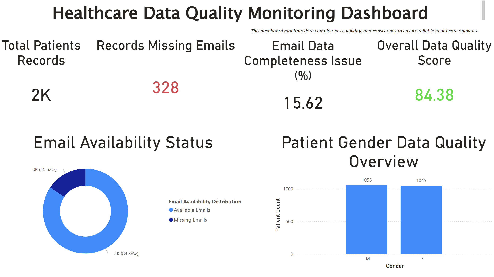
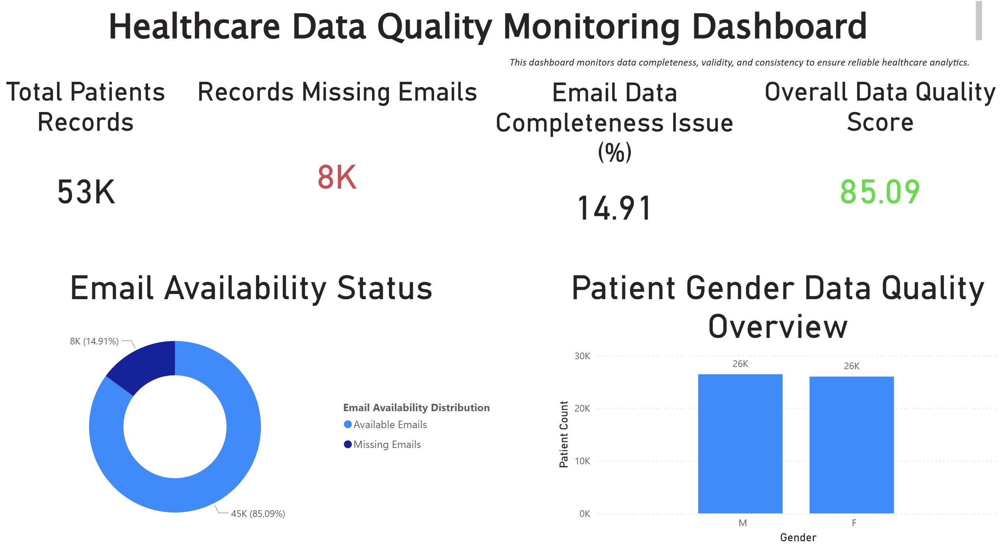

Healthcare Data Quality Monitoring System

Problem Statement

Healthcare data is highly sensitive to quality issues such as missing contact information, duplicate patient records, and invalid entries.These issues directly impact reporting accuracy, patient communication, and operational decision-making.

Objective

To design and build an end-to-end data quality monitoring system that identifies, measures, and visualizes data integrity issues in a healthcare dataset.

Solution Overview

Designed and implemented a data quality monitoring workflow that:

Simulates real-world patient datasets with controlled data quality issues
Stores structured data in PostgreSQL for analysis
Applies SQL-based validation rules to detect completeness, uniqueness, and validity issues
Presents insights through an interactive Power BI dashboard
Automates the workflow using a reusable pipeline script

Architecture
Python → CSV → PostgreSQL → SQL Checks → Power BI Dashboard

Key Insights Delivered
~15% of patient records missing email → risk to communication workflows
Duplicate patient entries detected based on name + DOB
Invalid data entries (e.g., gender, future DOB) identified
Overall data quality score highlights system health at a glance

Dashboard Preview

Tech Stack
Python (Pandas, Faker)
SQL (PostgreSQL)
Power BI
Git & GitHub

Data Pipeline
Implemented a simple, reusable pipeline to automate the workflow:

Data generation
Data ingestion into PostgreSQL
Preparation for reporting

Run pipeline:

python pipeline/run_pipeline.py

Scalability

Validated system performance by scaling dataset:

2,000 → 50,000 records

The system maintained consistent data quality detection and dashboard responsiveness across larger volumes.

Key Learnings
Data quality issues must be addressed before analytics to avoid misleading insights
SQL can be effectively used to build reusable validation frameworks
Dashboard design should focus on surfacing actionable issues, not just visuals
End-to-end workflows are more impactful than isolated analysis

Future Improvements
Automate scheduling using tools like cron or Airflow
Introduce real-time validation checks
Expand data quality rules for broader healthcare datasets